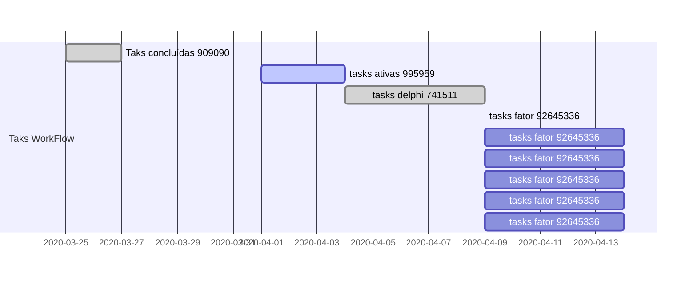

```mermaid
gantt
dateFormat  YYYY-MM-DD
section Taks WorkFlow
Taks concluídas     909090       :done,    des1, 2020-03-25,2020-03-27
tasks ativas      995959         :active,  des2, 2020-04-01, 3d
tasks delphi     741511          :done,    des3, after des2, 5d
tasks fator      92645336:       :  des4, after des3, 5d7
tasks fator      92645336:       :  des4, after des3, 5d
tasks fator      92645336:       :  des4, after des3, 5d
tasks fator      92645336:       :  des4, after des3, 5d
tasks fator      92645336:       :  des4, after des3, 5d
tasks fator      92645336:       :  des4, after des3, 5d
```
